<div align="center">


# GameTalk Translator

**Speak Arabic. Read English. Keep playing.**<br>
**تكلّم عربي، اقرأ إنجليزي، وكمّل لعبك.**

[](#en-install)
[](#en-install)
[](#en-how)
[](#en-cloud)
[](#en-cloud)
[](LICENSE)

**[English](#english)** · **[العربية](#arabic)**

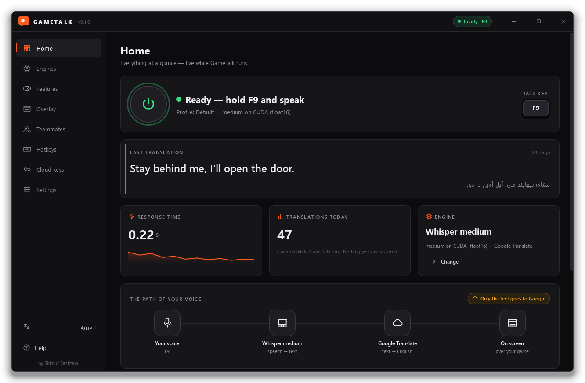

<sub>The main window: live status, your last translation, response time, and the path your voice takes.</sub>

</div>

---

<a id="english"></a>

## 🇬🇧 English

### Contents

- [What is GameTalk?](#en-what)
- [Highlights](#en-highlights)
- [Screenshots](#en-screenshots)
- [How it works](#en-how)
- [Installation](#en-install)
- [First run: 5 minutes](#en-first-run)
- [Everyday use](#en-usage)
- [Speech and translation engines](#en-engines)
- [Cloud services: Azure and Google (optional)](#en-cloud)
- [All features](#en-features)
- [The main window, page by page](#en-settings)
- [Profiles per game](#en-profiles)
- [Privacy](#en-privacy)
- [Performance](#en-performance)
- [Troubleshooting](#en-troubleshooting)
- [For developers](#en-developers)
- [Author and license](#en-license)

<a id="en-what"></a>

### 🎮 What is GameTalk?

GameTalk Translator is a Windows app for Arabic-speaking gamers who play with English-speaking
teammates.

1. **Hold a key** (default **F9**) and speak Arabic, in any dialect.
2. **Let go.** About a second later, a small overlay above your game shows the sentence in natural
   English, e.g. «خليكم وراي، أنا رح أفتح الباب» → *"Stay behind me, I'll open the door."*
3. **Say it** yourself on voice chat, with optional Arabic-letter pronunciation help.

It also works the other way: **teammate subtitles** turn what your teammates say into Arabic
subtitles.

<p align="center"></p>
<p align="center"><sub>Bottom: your Arabic, translated to English, with pronunciation help. Top: a teammate's English, subtitled in Arabic.</sub></p>

> **Safe for games.** GameTalk never speaks for you, never types into a game, and never injects
> into, hooks or modifies any game. It listens for its hotkey through Windows Raw Input and draws a
> click-through window that never takes focus away from your game.

<a id="en-highlights"></a>

### ✨ Highlights

| | |
|---|---|
| 🎙️ **Push-to-talk, toggle or open mic** | Keyboard key, mouse button (Mouse4/5) or controller button (RB, …) |
| 💻 **Works fully offline** | Whisper runs on your NVIDIA GPU or your CPU; nothing leaves your PC |
| ☁️ **Optional cloud engines** | Azure Speech knows 17 Arabic dialects; translate with Azure Translator or **Google Translate** (including Google's Translation LLM) |
| 🖥️ **A main window that feels like gaming gear** | Dark, animated, live dashboard, in the style of SteelSeries GG |
| 🪟 **Overlay that stays out of your way** | Click-through, never steals focus. Design its position, size, colours and fonts per game with a live preview |
| 👥 **Teammate subtitles** | Translates what you *hear* (game or Discord) into Arabic |
| ⌨️ **Quick text box** | Press F8, type Arabic, get English for text chat |
| 💬 **Quick phrases** | "Enemy spotted!" on Numpad1, shown instantly |
| 📘 **Learning mode** | Your personal phrasebook plus flash cards, so you need the app less over time |
| 🇸🇦 **Full Arabic interface** | Right-to-left everywhere, and every feature explained in Arabic and English |
| 🪶 **Lightweight** | 0% CPU when idle; the mic is only open while you hold the key |

<a id="en-screenshots"></a>

### 📸 Screenshots

| Engines: pick who listens and who translates | Features: every switch, with search |
|:---:|:---:|
| 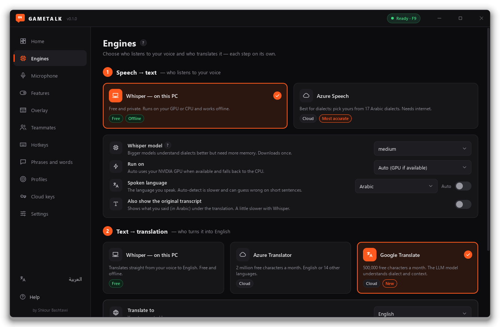 | 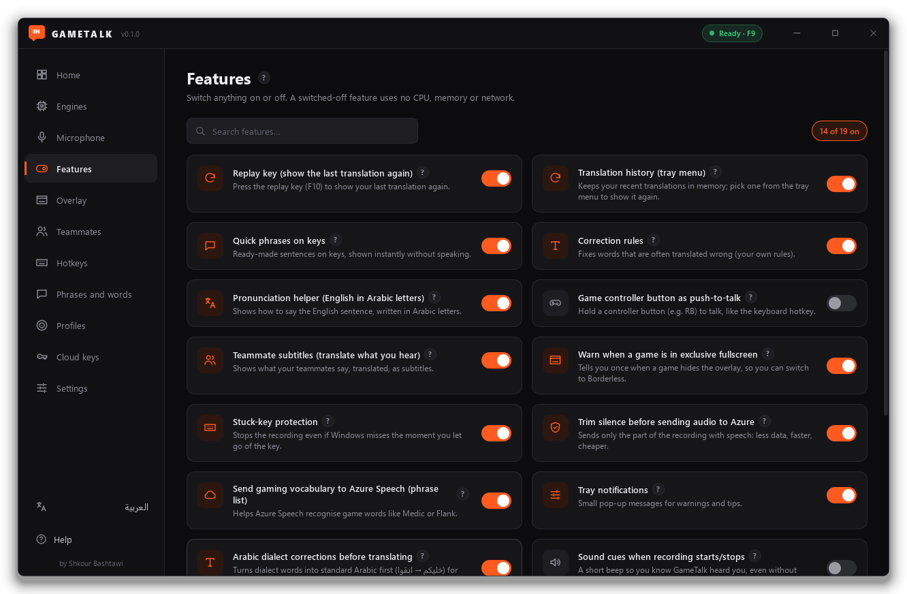 |
| **Overlay designer with live game preview** | **Hotkeys: click, then press any key** |
| 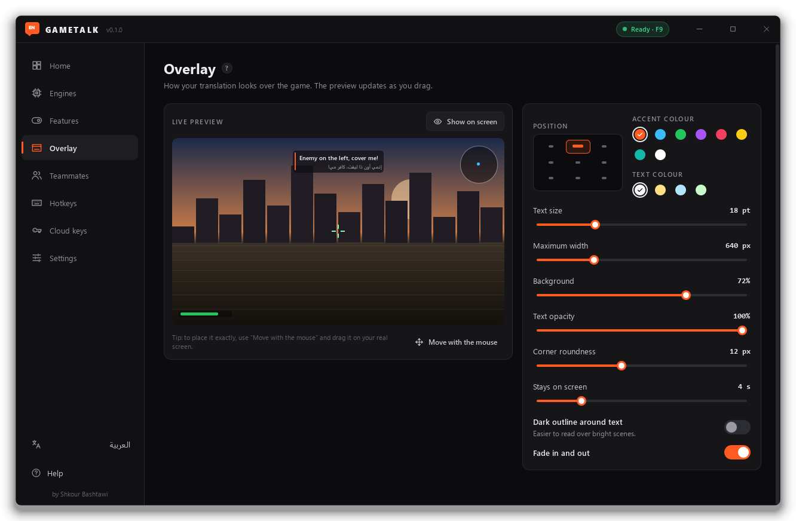 | 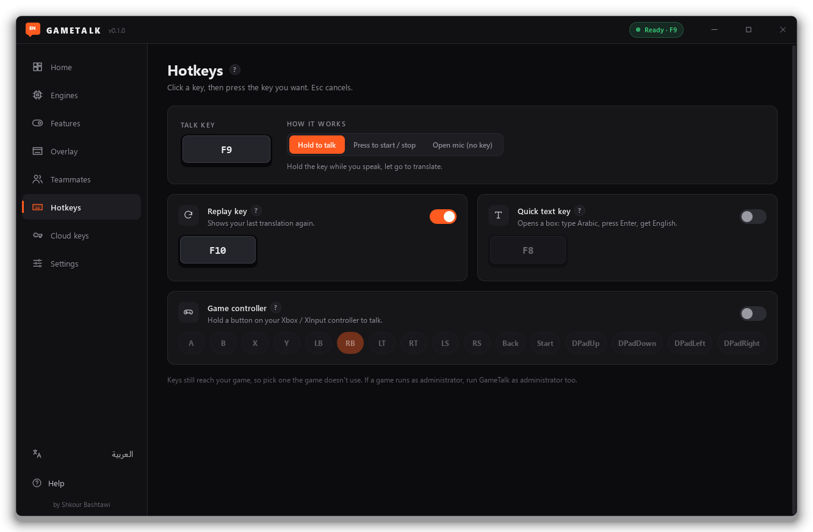 |
| **Teammate subtitles** | **Cloud keys (Azure and Google)** |
| 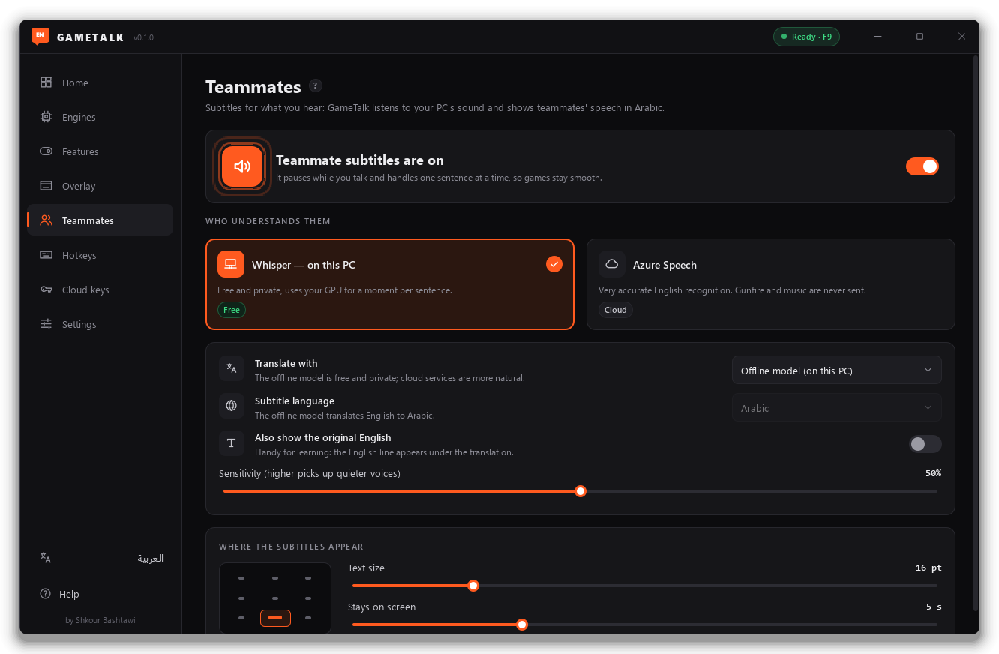 | 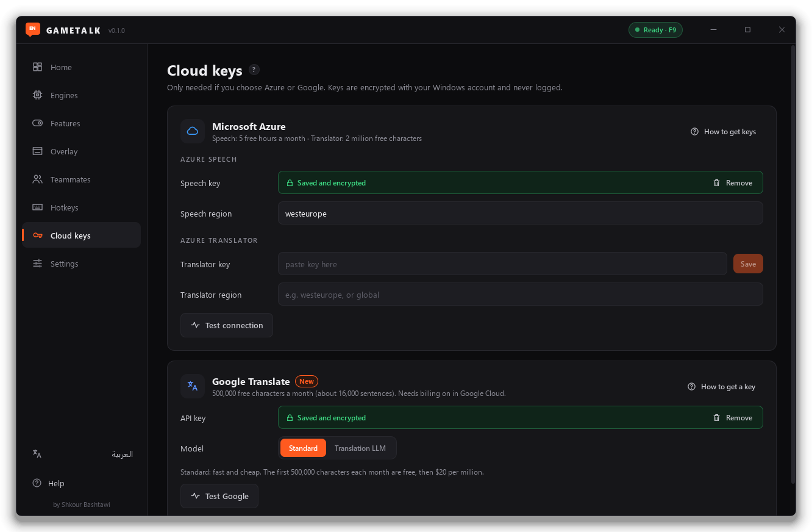 |

| **Phrases and words: quick phrases, corrections, vocabulary** | **Profiles per game** |
| 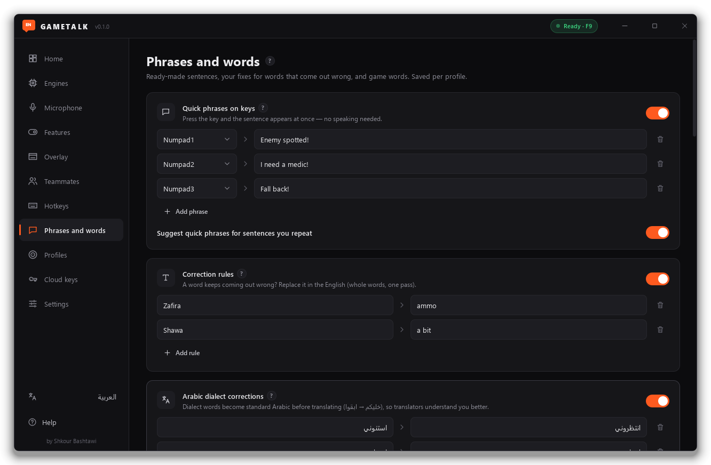 | 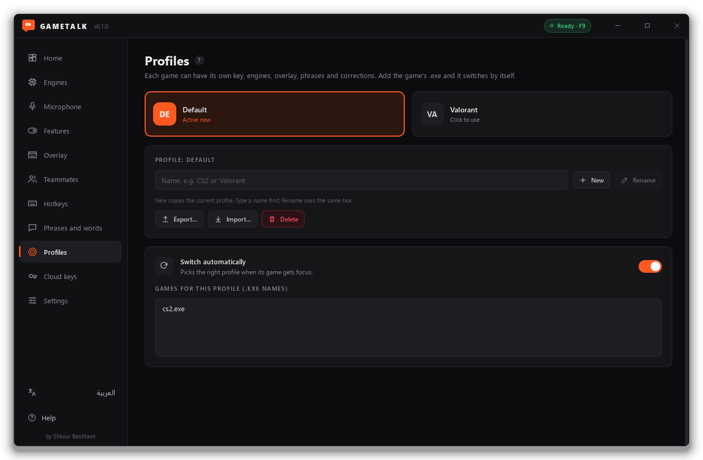 |

<details>
<summary><b>More screenshots: microphone, settings, self-test, phrasebook, quick text</b></summary>

| | |
|:---:|:---:|
| Microphone test<br>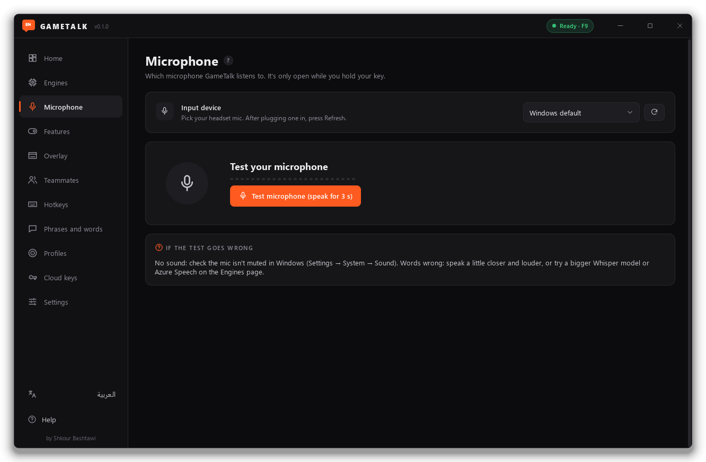 | Settings<br>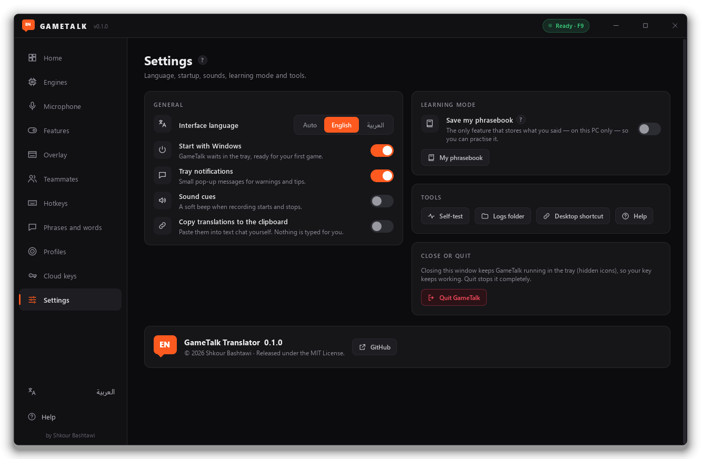 |
| Overlay states<br> | Quick text box (F8)<br> |
| Self-test<br> | My phrasebook<br> |
| Built-in help<br> | |

</details>

<a id="en-how"></a>

### ⚙️ How it works

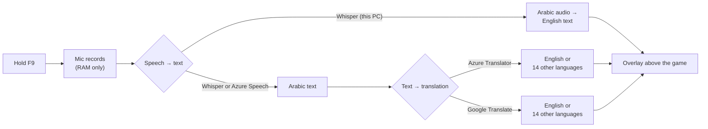
```mermaid
flowchart LR
    K["Hold F9"] --> M["Mic records<br/>(RAM only)"]
    M --> S{"Speech → text"}
    S -->|"Whisper (this PC)"| W["Arabic audio →<br/>English text"]
    S -->|"Whisper or Azure Speech"| AS["Arabic text"]
    AS --> T{"Text → translation"}
    T -->|"Azure Translator"| AT["English or<br/>14 other languages"]
    T -->|"Google Translate"| GT["English or<br/>14 other languages"]
    W --> O["Overlay above the game"]
    AT --> O
    GT --> O
```

You choose the two steps **separately** on the **Engines** page:

| Step | On this PC (free, private) | Cloud (optional) |
|---|---|---|
| **1. Speech → text** | Whisper `tiny` → `large-v3`, on GPU (CUDA) or CPU | **Azure Speech**: 17 Arabic dialects (ar-SA, ar-JO, ar-EG, …) · **Google Chirp 3**: Arabic dialects (preview) with built-in noise removal |
| **2. Text → translation** | Whisper translates straight from your voice to English | **Azure Translator** or **Google Translate** (Standard or Translation LLM): English or 14 other languages |

<a id="en-install"></a>

### 📦 Installation

#### Option A: installer (recommended)

1. Download **`GameTalk-Setup-x.y.z.exe`** from the
   **[Releases page](https://github.com/Cavebest/GameTalk/releases/latest)**.
2. Run it and choose **English or Arabic**. It installs to `Program Files` by default. You can
   pick *"Install for me only"* if you don't have admin rights.
3. Optional: a desktop shortcut, and start with Windows.

You don't need Python. NVIDIA GPU support (cuBLAS) is included, and without an NVIDIA GPU the app
runs on the CPU. To uninstall, go to **Windows Settings → Apps**. Your settings in
`%APPDATA%\GameTalk` are kept.

> Windows SmartScreen may warn about an *unknown publisher* because the app isn't code-signed.
> Click **More info → Run anyway**.

#### Option B: from source

Requires Windows 10/11 and [Python 3.10+](https://www.python.org/downloads/) (tested on 3.14).

```bash
git clone https://github.com/Cavebest/GameTalk.git
```

Then double-click **`GameTalk.bat`**. The first time, it creates `.venv` and installs everything
(GPU support is added automatically if an NVIDIA GPU is found). After that it opens the main
window.

<details>
<summary>Manual install</summary>

```bash
py -m venv .venv
```

```bash
.venv\Scripts\pip install -e .[cuda]
```

```bash
.venv\Scripts\python -m gametalk.launcher
```

`[cuda]` adds NVIDIA's cuBLAS runtime so Whisper can use an NVIDIA GPU without the CUDA toolkit.
Leave it off on machines without an NVIDIA GPU. cuDNN is not needed. If a GPU ever reports a
missing `cudnn*.dll`, run `pip install nvidia-cudnn-cu12`.

</details>

<a id="en-first-run"></a>

### 🚀 First run: 5 minutes

1. **Open GameTalk**: the desktop shortcut, `GameTalk.exe`, or `GameTalk.bat`.
2. On **Engines**, pick who listens and who translates. The default is Whisper on this PC.
3. On **Microphone**, pick your headset mic and press **Test**.
4. That's it: GameTalk is already listening for your key, and **Home** turns green: *Ready — hold
   F9 and speak*. Close the window whenever you like: GameTalk keeps running in the **hidden
   icons** next to the clock. Click that icon to open the window again.
   - The first time, the Whisper model downloads once (`small` ≈ 480 MB). After that it works
     offline.
5. In your game, **hold F9, speak Arabic, and let go**. The translation also appears on **Home**.
6. Something not working? Press **Self-test**. It checks everything and tells you what to fix.

> 💡 Use **Borderless** or **Windowed** fullscreen in your game. *Exclusive* fullscreen hides every
> overlay, and GameTalk warns you once if it detects it.

<a id="en-usage"></a>

### 🕹️ Everyday use

| Action | Default |
|---|---|
| Talk (push-to-talk) | **Hold F9**, speak, release |
| Toggle mode | Press once to start and again to stop |
| Open mic | No key: GameTalk hears when you start and stop talking, and the key mutes/unmutes |
| Show the last translation again | **F10** |
| Quick text box (type instead of talk) | **F8** |
| Quick phrases | Any key you assign, e.g. **Numpad1** → *"Enemy spotted!"* |
| Controller | An Xbox/XInput button, e.g. **RB** |
| Close the window (X) | GameTalk stays in the hidden icons (tray), your key keeps working |
| Pause without quitting | The power button on **Home**, or *Enabled* in the tray menu |
| Tray icon | Click: open GameTalk. Right-click: profile, recent translations, self-test, help, exit |
| Main window shortcuts | **Ctrl+1 … Ctrl+8** switch pages |

- **Keep talking**: you can start the next sentence while the previous one is still being
  translated. A small red dot means *"you are still recording"*.
- An accidental short tap just shows *"Hold F9 while you speak"*. Mouse-button chatter is ignored.
- Supported keys: F1–F24, Insert, Home, End, PageUp/Down, Pause, ScrollLock, numpad keys,
  Mouse4 and Mouse5. The key still reaches the game, so pick one the game doesn't use.

<a id="en-engines"></a>

### 🧠 Speech and translation engines

| Whisper model | Size | Notes |
|---|---|---|
| `tiny` / `base` | 75–145 MB | Very fast, weaker with dialects |
| **`small`** (default) | ~480 MB | Good balance, well under a second on GPU |
| `medium` | ~1.5 GB | Noticeably more natural English for Gulf, Levantine and Egyptian dialects |
| `large-v3` | ~3 GB | Most accurate local model (~3 GB VRAM) |

| Translator | Cost | Best for |
|---|---|---|
| **Whisper** (on this PC) | Free | Privacy; works offline; English only |
| **Azure Translator** | 2 million characters/month free | Many languages, fast |
| **Google Translate: Standard** | 500,000 characters/month free, then $20 per million | Fast and cheap |
| **Google Translate: Translation LLM** | $10 per million characters in + $10 out (same monthly credit) | Better with dialect and context |

**Offline text translation** uses small OPUS-MT models (Arabic ⇄ English). They power the quick
text box and teammate subtitles without any cloud service.

**Arabic dialect corrections** run before text translation and turn dialect words into standard
Arabic (خليكم → ابقوا, هلق → الآن, …), which makes every translator more accurate. The starter
list can be edited per game.

<a id="en-cloud"></a>

### ☁️ Cloud services: Azure and Google (optional)

Everything works without the cloud. Add a service only if you want more accuracy for your
dialect or for translation. You enter keys on the **Cloud keys** page. They are **encrypted with
your Windows account (DPAPI)**, never logged, never exported, and never shown again after saving.

#### Microsoft Azure

The free **F0** tiers are enough for voice chat: 5 hours of speech and 2 million characters of
translation per month.

1. Go to [portal.azure.com](https://portal.azure.com/) → **Create a resource** → **Speech** →
   *Keys and Endpoint*. Copy **Key 1** and the **Location/Region**.
2. **Create a resource** → **Translator**. Copy its **Key** and **Region** (`global` for a global
   resource).
3. In GameTalk, open **Cloud keys**, paste them, and press **Test connection**.

One *Azure AI services* multi-service resource also works: use the same key and region twice.

#### Google Translate

1. Go to [console.cloud.google.com](https://console.cloud.google.com/), create a project, and turn
   on **billing**. Google needs a card even for the free amount.
2. **APIs & Services → Library** → enable **Cloud Translation API**.
3. **APIs & Services → Credentials → Create API key**. It's safest to restrict the key to the
   Cloud Translation API.
4. In GameTalk, open **Cloud keys**, paste the key, choose **Standard** or **Translation LLM**,
   and press **Test Google**. The LLM also needs your **Project ID**, which is on the Cloud
   console home page.
5. **Google Chirp 3 (speech → text):** also enable the **Cloud Speech-to-Text API**, enter your
   **Project ID**, then pick *Google Chirp 3* on **Engines**. It costs about $0.016 per minute of
   speech (no free minutes; new Google Cloud accounts get trial credit). The *Noise removal*
   switch strips game sound from your mic. **Home** shows how long each stage took (speech →
   text, translation, total), so you can compare engines.

The first 500,000 characters each month are free, about 16,000 short sentences, which is more
than enough for gaming. GameTalk counts your usage for all three services and warns at 80% and
100%.

| Engines chosen | What leaves your PC |
|---|---|
| Whisper + Whisper | Nothing |
| Whisper + Azure Translator / Google | The recognised **text** only |
| Azure Speech + Azure Translator / Google | Your push-to-talk **audio** (silence trimmed) to Azure, then the text |
| Google Chirp 3 + Azure Translator / Google | Your push-to-talk **audio** (silence trimmed) to Google, then the text |

<a id="en-features"></a>

### 🧩 All features

You can switch every feature on or off on the **Features** page, which also has a search box. A
switched-off feature uses no CPU, memory or network. Each one has a **?** button with a full
explanation in Arabic and English.

| Feature | What it does | Default |
|---|---|:---:|
| 🔁 Replay key | **F10** shows your last translation again | On |
| 🕘 History | Your last translations in the tray menu (memory only) | On |
| 💬 Quick phrases | Ready-made sentences on keys, shown instantly with no speech needed | Off |
| 💡 Quick-phrase suggestions | Say the same sentence three times and GameTalk offers to put it on a key | On |
| ✏️ Correction rules | Your own fixes, e.g. *"Zafira" → "ammo"* (whole words, one pass) | On |
| 🇸🇦 Arabic dialect corrections | Dialect → standard Arabic before translating | On |
| 🔤 Pronunciation helper | Shows the English in Arabic letters: *"Wait for me"* → «وايت فور مي» | Off |
| 🎮 Game controller | An XInput button as push-to-talk, plus an optional replay button | Off |
| 👥 Teammate subtitles | Listens to what your PC plays and shows teammates' speech in Arabic. Recognition by Whisper or Azure; translation by the offline model, Azure or Google | Off |
| ⌨️ Quick text box | **F8**: type Arabic, press Enter, get English you can copy into text chat | Off |
| 🎙️ Open mic | No key needed. Voice activity detection finds the start and end of each sentence | Off |
| 📘 Learning mode | Your phrasebook plus flash-card practice. This is the only feature that saves what you said, and only on this PC | Off |
| 📋 Copy to clipboard | Puts each translation on the clipboard for you to paste yourself | Off |
| 🔔 Sound cues | Soft beeps when recording starts and stops (volume adjustable) | Off |
| 📊 Cloud usage counter | Tracks this month's free quota for Azure and Google | On |
| 🗣️ Azure phrase list | Sends your gaming vocabulary to Azure Speech so it recognises *Medic*, *Flank*, … | On |
| 🖥️ Fullscreen warning | Tells you once when a game uses exclusive fullscreen | On |
| 🧷 Stuck-key protection | Stops recording even if Windows misses the key release | On |
| ✂️ Silence trimming | Sends only the speech part to Azure: less data, faster and cheaper | On |
| 🔔 Tray notifications | Short notices from the tray icon | On |

<a id="en-settings"></a>

### 🖥️ The main window, page by page

| Page | What's there |
|---|---|
| **Home** | Power button (pause/resume), live status (Ready / Listening / Translating), your last translation typing itself in, response-time chart, today's count, the path your voice takes (it lights up on every translation), free-quota gauges, quick actions and tips |
| **Engines** | Step 1 and step 2 as cards: Whisper model and GPU/CPU, spoken language, Azure dialect, original transcript, target language, Google model, gaming mode, pronunciation helper. A tag always shows what leaves your PC |
| **Microphone** | Pick your mic (and refresh after plugging one in), then a 3-second test with a live level meter and the translated result |
| **Features** | Every switch, with search and a count of what's on |
| **Overlay** | A live preview over a mock game frame, updated while you drag: position (3×3 map), shift and distance, text size, width, background and text opacity, corners, duration, accent/text/background colours, outline, fade, font, monitor. **Show on screen** shows a sample; **Move with the mouse** lets you drag the real overlay |
| **Teammates** | On/off, which speakers to listen to, who recognises (Whisper or Azure), who translates (offline, Azure or Google), language, sensitivity, where and how big the subtitles are |
| **Hotkeys** | Click a keycap and press a key (or Mouse 4/5): talk key, replay key, quick text key. Hold / toggle / open mic, controller buttons, stuck-key protection |
| **Phrases and words** | Quick phrases (key → sentence, plus suggestions from what you say often), correction rules, Arabic dialect corrections, gaming vocabulary |
| **Profiles** | Your game profiles as cards: switch, create, rename, delete, export/import, and the game `.exe` names that switch them automatically |
| **Cloud keys** | Azure and Google keys with connection tests, and this month's free-quota usage |
| **Settings** | Language (Auto / English / العربية), start with Windows, notifications, sound, clipboard, learning mode, tools, and **Quit GameTalk** |

Everything is in this one window. Closing it (X) only hides GameTalk to the tray, and the window
itself is unloaded then, so it uses no memory or GPU while you play.

<a id="en-profiles"></a>

### 🎯 Profiles per game

Each profile keeps its own hotkey, mode, microphone, model, engines, overlay position, size,
opacity, font, duration, vocabulary, quick phrases and corrections. Add the game's executable name
(Task Manager → Details, e.g. `cs2.exe`), and the profile switches on automatically when that game
gets focus.

<a id="en-privacy"></a>

### 🔒 Privacy

- **Local mode sends nothing.** Recognition and translation run on your PC.
- The **mic is open only while you hold the key**. Audio lives in RAM and is discarded after each
  sentence. Nothing is recorded to disk.
- **Google and Azure Translator only ever get text**, never your voice. Only Azure Speech gets
  audio, and only if you choose it.
- **Logs** (`%APPDATA%\GameTalk\logs`) contain timings and error types only, never what you said.
- **Keys** are encrypted with Windows DPAPI. The Google key travels in a request header, never in
  a URL.
- The only other network access is the one-time model download from Hugging Face, with telemetry
  off.
- Learning mode is **opt-in**, and it's the only place sentences are stored (`phrasebook.json`, on
  this PC).

<a id="en-performance"></a>

### ⚡ Performance

- **Idle CPU: 0%.** GameTalk runs no polling or timers while idle, and the mic is closed.
- The hotkey uses **Raw Input**, not keyboard hooks. It sits outside the game's input path, so it
  adds **no input latency**.
- A translation appears **~0.1–0.3 s** after you release the key (NVIDIA GPU, `medium`).
- Close the main window while you play: it's unloaded completely and GameTalk keeps running in
  the tray.

| Mode | RAM | Note |
|---|---|---|
| Local, GPU | ~800 MB (+ ~1 GB VRAM) | The model stays loaded for instant replies |
| Local, CPU | ~430 MB | |
| Azure Speech | ~90 MB | No local model loaded |
| + subtitles / pronunciation / controller | +~120 MB | Offline EN→AR model and dictionary |

<a id="en-troubleshooting"></a>

### 🧯 Troubleshooting

| Problem | Fix |
|---|---|
| I can't see the overlay in my game | Switch the game to **Borderless** or **Windowed** fullscreen |
| Nothing happens when I press the key in the game | If the game runs **as administrator**, run GameTalk as administrator too |
| "Didn't catch that" | Test the mic on the **Microphone** page and hold the key a moment longer |
| The translation isn't accurate | Try Whisper `medium`/`large-v3`, Azure Speech with your dialect, or Google's Translation LLM, and add correction rules |
| Google: "turn on billing" / "enable the API" | Do steps 1–2 of [Google Translate](#en-cloud) for the project that owns the key |
| The first translation is slow | The first run on a new GPU compiles once (~20 s). It's instant after that |
| Mic unplugged or changed | **Microphone → Refresh**. GameTalk also retries automatically |
| Anything else | Run **Self-test**, then **Copy report** (safe to share) |

> Some kernel-level anti-cheats dislike any overlay. GameTalk doesn't inject or hook anything, but
> check your game's rules.

<a id="en-developers"></a>

### 👩‍💻 For developers

```bash
.venv\Scripts\pip install -e .[cuda,dev]
```

```bash
.venv\Scripts\python -m pytest
```

```bash
.venv\Scripts\ruff check .
```

- **Open GameTalk with its window:** `python -m gametalk.launcher` (if it's already running, its
  window comes to the front).
- **Tray only (like Windows startup):** `python -m gametalk [--show] [--settings] [--azure] [--test-mic] [--selftest] [--phrasebook]
  [--verbose]`. If GameTalk is already running, these options are forwarded to it.
- **Build the installer:** `packaging\build_installer.bat` builds `dist\GameTalk\GameTalk.exe`
  with PyInstaller and `dist\GameTalk-Setup-<version>.exe` with Inno Setup 6. Set
  `GAMETALK_CUDA=0` for a smaller build without NVIDIA support.
- The tests load the whole QML interface off-screen and fail on any QML warning, and they check
  that every visible string has an Arabic translation.

<details>
<summary>Project structure</summary>

| Module | Role |
|---|---|
| `gametalk/hub/` | Main window, inside the app: `__init__.py` (open / close-to-tray), `backend.py` (settings, live stats, actions) and `qml/` (pages and animated components) |
| `gametalk/__main__.py` | Tray app startup, logging, single instance |
| `gametalk/app.py` | Controller: hotkey → recorder → speech worker → overlay; `stats`/`preview` commands |
| `gametalk/hotkey.py` | Global hotkeys via Raw Input, foreground-game watcher |
| `gametalk/audio.py` | Push-to-talk recorder, device list, silence trimming |
| `gametalk/speech.py` | faster-whisper on a worker thread, CUDA → CPU fallback |
| `gametalk/translate.py` | Speech → text → translation pipelines, gaming mode, cleanup |
| `gametalk/azure.py` | Azure Speech (REST + SDK phrase lists) and Translator v3 |
| `gametalk/google.py` | Google Cloud Translation (Standard and Translation LLM) |
| `gametalk/local_mt.py` | Offline OPUS-MT Arabic ⇄ English (CTranslate2) |
| `gametalk/overlay.py` | Click-through overlay that never takes focus |
| `gametalk/teammates.py`, `voice.py`, `gamepad.py` | Teammate subtitles, open mic, controller |
| `gametalk/quick_text.py`, `learn.py`, `phrasebook.py`, `pronounce.py` | Quick text, learning mode, pronunciation |
| `gametalk/launcher.py`, `tray.py`, `options.py`, `help.py`, `diagnostics.py`, `theme.py` | Opening GameTalk, tray, shared labels, help, self-test |
| `gametalk/i18n.py`, `i18n_ar.py` | Arabic/English interface |
| `gametalk/config.py`, `credentials.py`, `usage.py`, `ipc.py`, `runtime.py`, `win32.py` | Settings, DPAPI keys, quota counter, local command channel, startup, Win32 |
| `packaging/` | PyInstaller spec, Inno Setup script, icon and version resources |
| `tests/` | 200+ pytest tests |

</details>

<a id="en-license"></a>

### 👤 Author and license

Created by **[Shkour Bashtawi](https://github.com/ShkourBashtawi)**.
Released under the **[MIT License](LICENSE)**. Third-party components (faster-whisper,
CTranslate2, Qt/PySide6, Whisper and OPUS-MT models, Microsoft Azure and Google Cloud services)
remain under their own licenses and terms. SteelSeries GG is only a style inspiration; GameTalk is
not affiliated with SteelSeries.

<div align="right"><a href="#english">⬆ Back to top</a></div>

---

<a id="arabic"></a>

<div dir="rtl">

## 🇸🇦 العربية

<p align="center">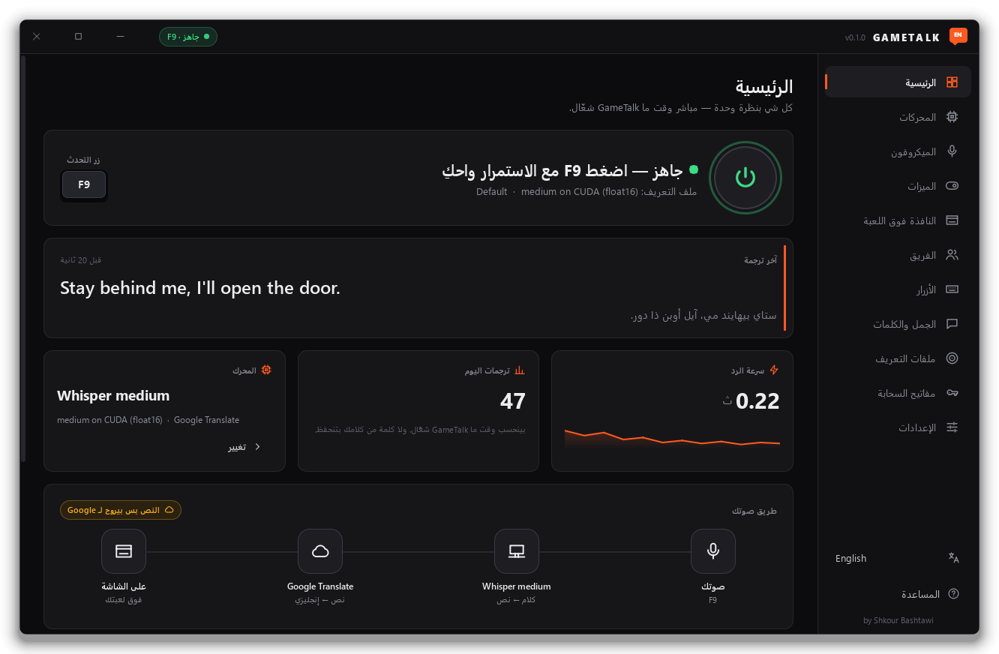</p>

### المحتويات

- [شو هو GameTalk؟](#ar-what)
- [أهم المميزات](#ar-highlights)
- [صور من البرنامج](#ar-screenshots)
- [كيف بيشتغل؟](#ar-how)
- [التثبيت](#ar-install)
- [أول تشغيل: 5 دقائق](#ar-first-run)
- [الاستعمال اليومي](#ar-usage)
- [محركات التعرّف والترجمة](#ar-engines)
- [الخدمات السحابية: Azure و Google (اختياري)](#ar-cloud)
- [كل الميزات](#ar-features)
- [النافذة الرئيسية صفحة صفحة](#ar-settings)
- [ملف تعريف لكل لعبة](#ar-profiles)
- [الخصوصية](#ar-privacy)
- [الأداء](#ar-performance)
- [حل المشاكل](#ar-troubleshooting)
- [المطوّر والترخيص](#ar-license)

<a id="ar-what"></a>

### 🎮 شو هو GameTalk؟

GameTalk Translator برنامج على ويندوز للاعبين العرب اللي بيلعبوا مع فريق بيحكي إنجليزي.

1. **اضغط الزر مع الاستمرار** (الافتراضي **F9**) واحكِ عربي بأي لهجة.
2. **اترك الزر**، وخلال ثانية تقريباً بتطلع لك الجملة بإنجليزي طبيعي فوق اللعبة.
   مثال: «خليكم وراي، أنا رح أفتح الباب» ← *"Stay behind me, I'll open the door."*
3. **اقرأها بصوتك** على الفويس شات. وإذا بدك، بيعرض لك كمان طريقة نطقها بحروف عربية.

وبيشتغل بالعكس كمان: **ترجمة كلام الفريق** بتعرض كلام زملائك مترجم للعربي كترجمة على الشاشة.

<p align="center"></p>

> **آمن مع الألعاب:** البرنامج ما بيحكي عنك، وما بيكتب شي باللعبة، وما بيدخل على ملفات اللعبة
> أو بيعدّلها أبداً. كل اللي بيعمله إنه يسمع زره، ويرسم نافذة شفافة فوق اللعبة ما بتاخذ منها
> التركيز وما بتمنع الماوس.

<a id="ar-highlights"></a>

### ✨ أهم المميزات

| | |
|---|---|
| 🎙️ **ضغط مستمر أو ضغطة تشغيل/إيقاف أو مايك مفتوح** | زر كيبورد، أو زر ماوس جانبي (Mouse4/5)، أو زر يد تحكم (RB مثلاً) |
| 💻 **بيشتغل بدون إنترنت** | Whisper بيشتغل على كرت NVIDIA أو المعالج، وما بيطلع شي من جهازك |
| ☁️ **محركات سحابية اختيارية** | Azure Speech بيفهم 17 لهجة عربية، والترجمة بـ Azure Translator أو **Google Translate** (ومعه موديل Translation LLM) |
| 🖥️ **نافذة رئيسية بإحساس برامج الجيمنغ** | غامقة ومتحركة ولوحة مباشرة، بستايل SteelSeries GG |
| 🪟 **نافذة فوق اللعبة ما بتزعجك** | الماوس بيمرّ من خلالها وما بتسرق التركيز، وبتصمّم مكانها وحجمها وألوانها لكل لعبة مع معاينة مباشرة |
| 👥 **ترجمة كلام الفريق** | بيترجم اللي *بتسمعه* (من اللعبة أو الديسكورد) للعربي |
| ⌨️ **مربع الكتابة السريع** | اضغط F8 واكتب عربي، بيطلع لك إنجليزي للشات الكتابي |
| 💬 **جمل جاهزة** | مثلاً *"Enemy spotted!"* على Numpad1، وبتظهر فوراً |
| 📘 **وضع التعلّم** | دفتر عباراتك وبطاقات تدريب، لحتى تصير تعتمد عليه أقل مع الوقت |
| 🇸🇦 **واجهة عربية كاملة** | من اليمين لليسار بكل مكان، وكل ميزة مشروحة بالعربي والإنجليزي |
| 🪶 **خفيف** | 0% معالج وهو مش شغّال، والمايك بيفتح بس وإنت ضاغط الزر |

<a id="ar-screenshots"></a>

### 📸 صور من البرنامج

| المحركات: مين يسمع ومين يترجم | الميزات: كل المفاتيح مع بحث |
|:---:|:---:|
| 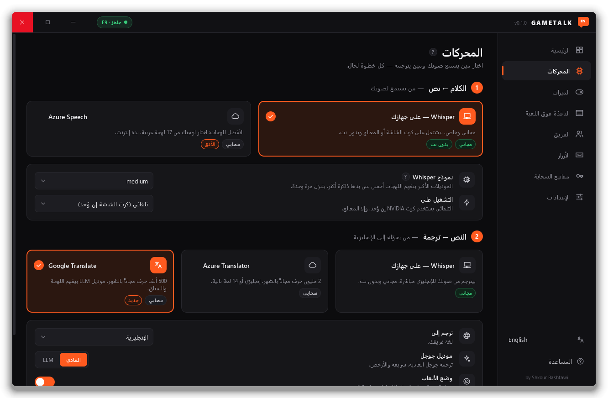 | 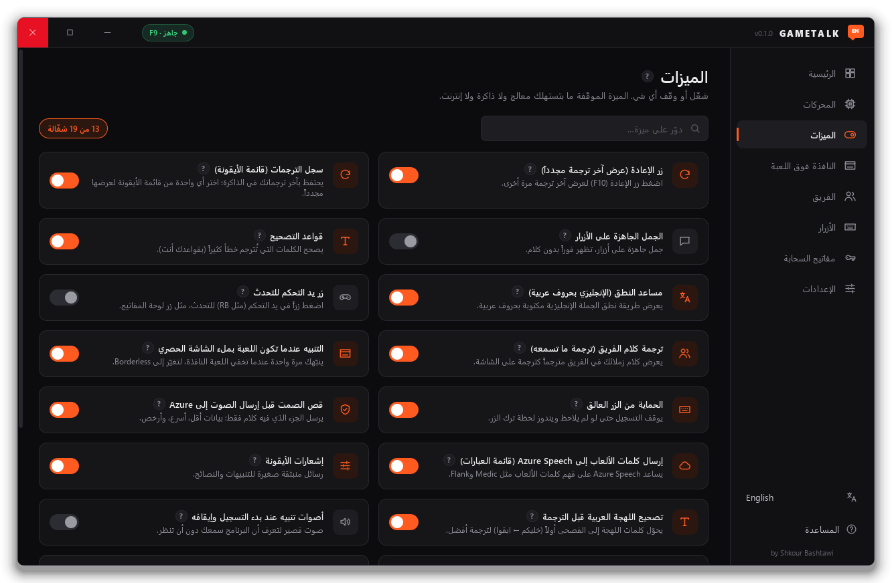 |
| **مصمّم النافذة مع معاينة مباشرة** | **الأزرار: اضغط، وبعدين اضغط أي زر** |
| 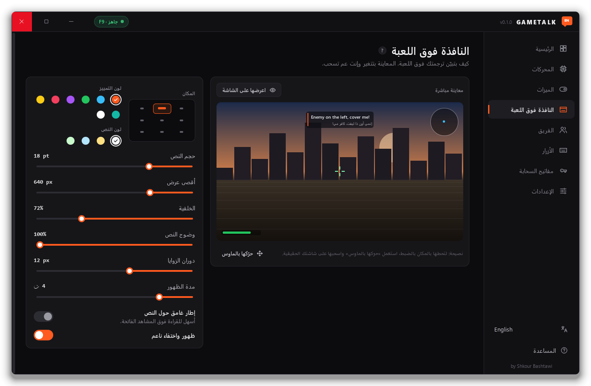 | 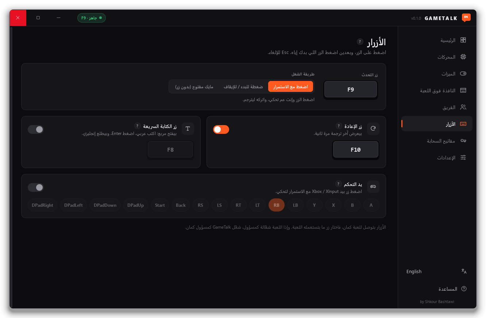 |
| **ترجمة كلام الفريق** | **مفاتيح السحابة (Azure و Google)** |
| 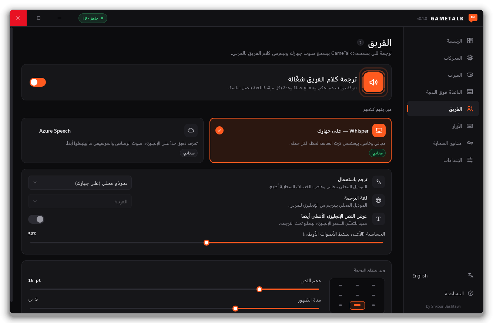 | 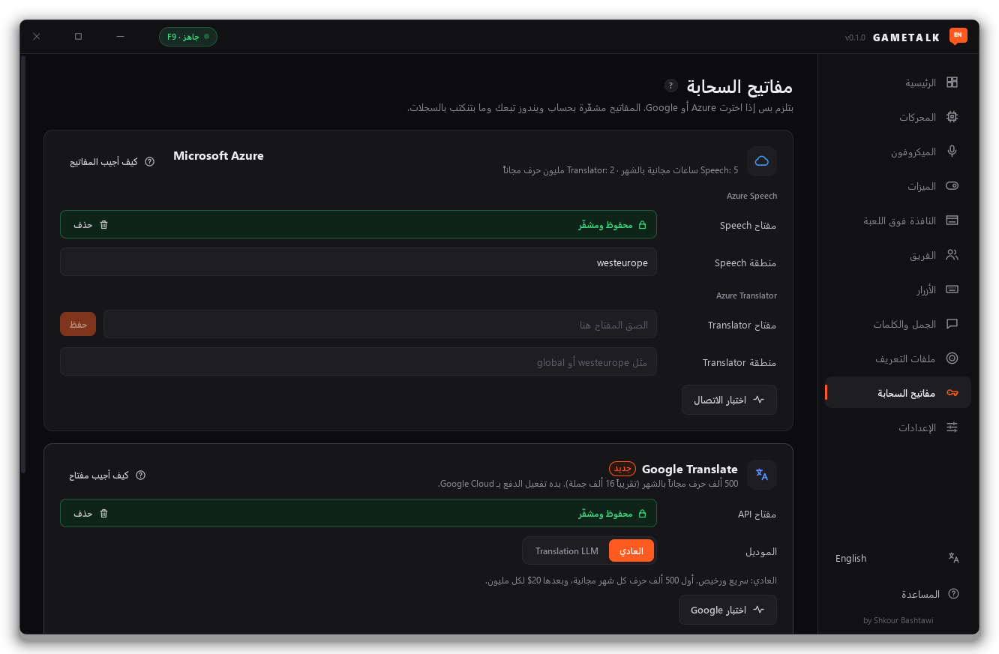 |

| **الجمل والكلمات: جمل جاهزة، تصحيحات، كلمات ألعاب** | **ملفات التعريف لكل لعبة** |
| 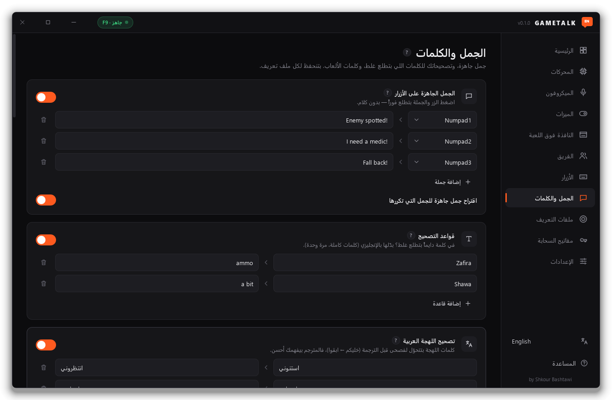 | 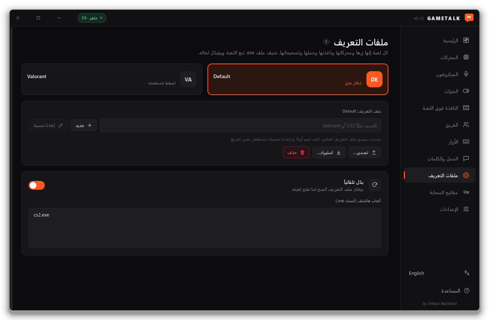 |

<details>
<summary><b>صور أكثر</b></summary>

| | |
|:---:|:---:|
| تجربة المايك<br>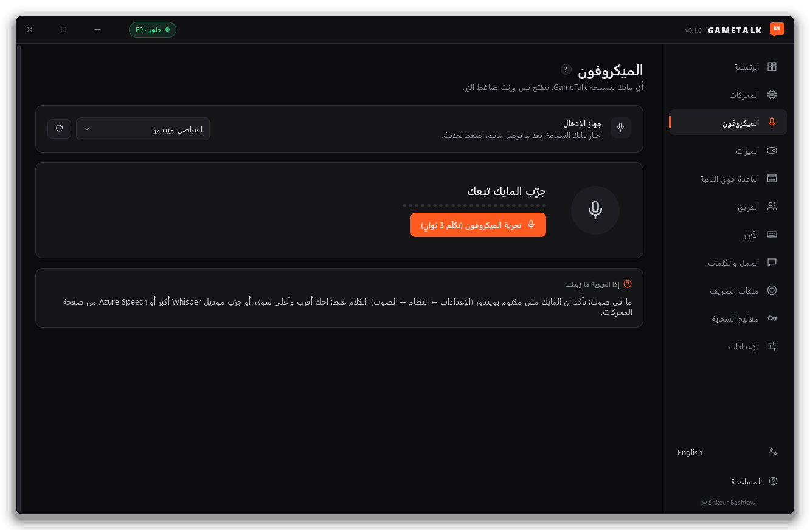 | الإعدادات<br>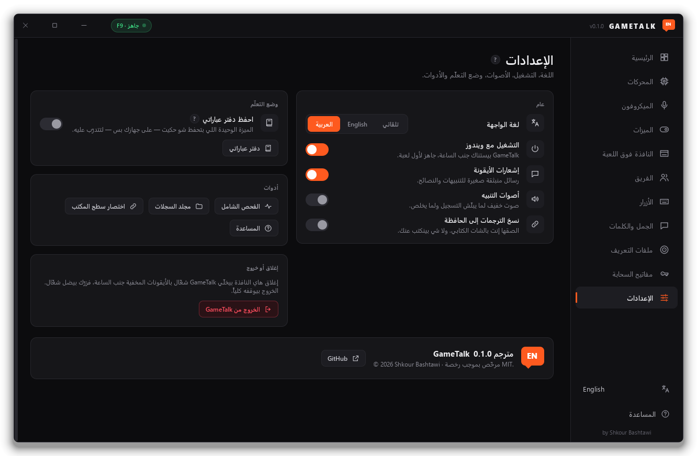 |
| المساعدة المدمجة<br> | |
| مراحل النافذة: بسمع، بعالج، الترجمة<br> | مربع الكتابة السريع (F8)<br> |
| الفحص الشامل<br> | دفتر عباراتي<br> |

</details>

<a id="ar-how"></a>

### ⚙️ كيف بيشتغل؟

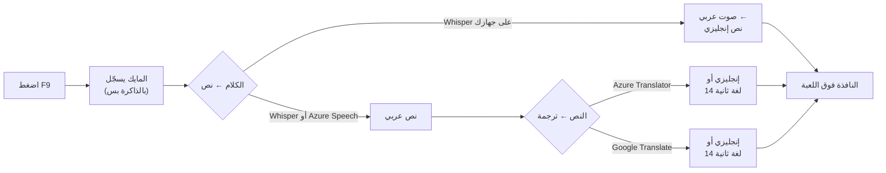
```mermaid
flowchart LR
    K["اضغط F9"] --> M["المايك يسجّل<br/>(بالذاكرة بس)"]
    M --> S{"الكلام ← نص"}
    S -->|"Whisper على جهازك"| W["صوت عربي ←<br/>نص إنجليزي"]
    S -->|"Whisper أو Azure Speech"| AS["نص عربي"]
    AS --> T{"النص ← ترجمة"}
    T -->|"Azure Translator"| AT["إنجليزي أو<br/>14 لغة ثانية"]
    T -->|"Google Translate"| GT["إنجليزي أو<br/>14 لغة ثانية"]
    W --> O["النافذة فوق اللعبة"]
    AT --> O
    GT --> O
```

بتختار الخطوتين **كل وحدة لحال** من صفحة **المحركات**:

| الخطوة | على جهازك (مجاني وخاص) | سحابي (اختياري) |
|---|---|---|
| **1. الكلام ← نص** | Whisper من `tiny` لـ `large-v3`، على كرت الشاشة أو المعالج | **Azure Speech**: 17 لهجة عربية (ar-SA، ar-JO، ar-EG، …) · **Google Chirp 3**: لهجات عربية (تجريبي) مع مزيل ضجيج مدمج |
| **2. النص ← ترجمة** | Whisper بيترجم من صوتك للإنجليزي مباشرة | **Azure Translator** أو **Google Translate** (العادي أو Translation LLM): إنجليزي أو 14 لغة ثانية |

<a id="ar-install"></a>

### 📦 التثبيت

#### الطريقة الأولى: ملف التثبيت (الأسهل)

1. نزّل **`GameTalk-Setup-x.y.z.exe`** من
   **[صفحة الإصدارات (Releases)](https://github.com/Cavebest/GameTalk/releases/latest)**.
2. شغّله واختار **العربية** أو الإنجليزية. بيتثبّت في `Program Files`، وإذا ما عندك صلاحيات
   مدير اختار *"التثبيت لي فقط"*.
3. اختياري: اختصار على سطح المكتب، وتشغيل تلقائي مع ويندوز.

ما بتحتاج Python. دعم كروت NVIDIA موجود جوّا، وإذا ما عندك كرت NVIDIA بيشتغل على المعالج.
لإزالة البرنامج: **إعدادات ويندوز ← التطبيقات**. إعداداتك في `%APPDATA%\GameTalk` بتضل محفوظة.

> ممكن يطلع لك تحذير SmartScreen إنه *ناشر غير معروف*، لأن البرنامج مش موقّع رقمياً. اضغط
> **More info ← Run anyway**.

#### الطريقة الثانية: من الكود

بتحتاج ويندوز 10/11 و [Python 3.10+](https://www.python.org/downloads/).

```bash
git clone https://github.com/Cavebest/GameTalk.git
```

بعدين اضغط دبل كليك على **`GameTalk.bat`**. أول مرة بيجهّز كل شي لحاله (وبيضيف دعم كرت
NVIDIA إذا لقاه)، وبعدها بيفتح النافذة الرئيسية.

<a id="ar-first-run"></a>

### 🚀 أول تشغيل: 5 دقائق

1. **افتح GameTalk**: من اختصار سطح المكتب، أو `GameTalk.exe`، أو `GameTalk.bat`.
2. من صفحة **المحركات** اختار مين يسمع ومين يترجم. الافتراضي Whisper على جهازك.
3. من صفحة **المايكروفون** اختار مايك السماعة واضغط **تجربة**.
4. وخلص: GameTalk صار يسمع زرّك، والصفحة **الرئيسية** بتصير خضرا: *جاهز — اضغط F9 مع
   الاستمرار واحكِ*. سكّر النافذة وقت ما بدك: البرنامج بيضل شغّال بـ **الأيقونات المخفية** جنب
   الساعة، واضغط على أيقونته لترجع تفتح النافذة.
   - أول مرة بينزّل موديل Whisper مرة وحدة بس (`small` حوالي 480 ميغا). بعدها بيشتغل بدون نت.
5. باللعبة: **اضغط F9 مع الاستمرار، احكِ عربي، واترك الزر**. الترجمة بتطلع كمان بالصفحة الرئيسية.
6. في مشكلة؟ اضغط **الفحص الشامل**. بيفحص كل شي وبيحكيلك شو تصلّح.

> 💡 خلّي اللعبة على **Borderless** أو **Windowed**. وضع ملء الشاشة *الحصري* (Exclusive
> Fullscreen) بيخبّي أي نافذة فوق اللعبة، والبرنامج بينبّهك مرة وحدة إذا لاحظه.

<a id="ar-usage"></a>

### 🕹️ الاستعمال اليومي

| شو بدك تعمل | الزر الافتراضي |
|---|---|
| تحكي (ضغط مستمر) | **اضغط F9 مع الاستمرار**، احكِ، واترك |
| وضع الضغطة | اضغط مرة للبدء ومرة للإيقاف |
| المايك المفتوح | بدون زر: البرنامج بيعرف لحاله متى بلّشت ومتى خلّصت، والزر بيكتم/بيفتح |
| إعادة عرض آخر ترجمة | **F10** |
| مربع الكتابة السريع | **F8** |
| الجمل الجاهزة | أي زر بتختاره، مثلاً **Numpad1** ← *"Enemy spotted!"* |
| يد التحكم | زر Xbox/XInput، مثلاً **RB** |
| إغلاق النافذة (X) | GameTalk بيضل بالأيقونات المخفية جنب الساعة، وزرّك بيضل شغّال |
| إيقاف مؤقت بدون خروج | زر التشغيل بالصفحة **الرئيسية**، أو *مفعّل* من قائمة الأيقونة |
| أيقونة البرنامج | ضغطة: بتفتح GameTalk. كبسة يمين: ملف التعريف، آخر الترجمات، الفحص، المساعدة، خروج |
| اختصارات النافذة الرئيسية | **Ctrl+1 … Ctrl+8** للتنقل بين الصفحات |

- **كمّل حكي**: بتقدر تبلّش الجملة الجاية والأولى لسا عم تترجم. النقطة الحمرا الصغيرة معناها
  *"لسا عم تسجّل"*.
- إذا ضغطت الزر بالغلط ضغطة قصيرة، بيطلع لك بس *"اضغط F9 مع الاستمرار وإنت عم تحكي"*.
- الأزرار المدعومة: F1–F24، Insert، Home، End، PageUp/Down، Pause، ScrollLock، أزرار الـ
  Numpad، Mouse4 و Mouse5. الزر بيوصل للعبة كمان، فاختار زر ما بتستعمله اللعبة.

<a id="ar-engines"></a>

### 🧠 محركات التعرّف والترجمة

| موديل Whisper | الحجم | ملاحظات |
|---|---|---|
| `tiny` / `base` | 75–145 ميغا | سريع جداً، أضعف مع اللهجات |
| **`small`** (الافتراضي) | ~480 ميغا | توازن ممتاز، أقل من ثانية على كرت الشاشة |
| `medium` | ~1.5 غيغا | إنجليزي أطبع بكثير للهجات الخليجية والشامية والمصرية |
| `large-v3` | ~3 غيغا | الأدق محلياً (بياخذ حوالي 3 غيغا من ذاكرة الكرت) |

| المترجم | السعر | الأحسن لـ |
|---|---|---|
| **Whisper** (على جهازك) | مجاني | الخصوصية وبدون نت؛ إنجليزي بس |
| **Azure Translator** | 2 مليون حرف مجاناً بالشهر | لغات كثيرة وسريع |
| **Google Translate: العادي** | 500 ألف حرف مجاناً بالشهر، وبعدها 20$ لكل مليون | سريع ورخيص |
| **Google Translate: Translation LLM** | 10$ لكل مليون حرف داخل + 10$ طالع (من نفس الرصيد الشهري) | أحسن مع اللهجة والسياق |

**الترجمة بدون نت للنصوص**: موديلات OPUS-MT صغيرة (عربي ⇄ إنجليزي)، وهي اللي بتشغّل مربع
الكتابة السريع وترجمة كلام الفريق بدون أي خدمة سحابية.

**تصحيح اللهجة**: قبل ترجمة النص، البرنامج بيحوّل كلمات اللهجة للفصحى (خليكم ← ابقوا، هلق ←
الآن، …)، وهاد بيخلّي أي مترجم أدق. في قائمة جاهزة، وبتقدر تعدّلها لكل لعبة.

<a id="ar-cloud"></a>

### ☁️ الخدمات السحابية: Azure و Google (اختياري)

كل شي بيشتغل بدون سحابة. ضيف خدمة بس إذا بدك دقة أعلى للهجتك أو للترجمة. المفاتيح بتحطها من
صفحة **مفاتيح السحابة**، وبتنحفظ **مشفّرة بحساب ويندوز تبعك (DPAPI)**، وما بتنكتب بالسجلات،
وما بتطلع مع التصدير، وما بتبيّن مرة ثانية بعد الحفظ.

#### Microsoft Azure

الخطة المجانية **F0** بتكفي للفويس شات: 5 ساعات كلام و2 مليون حرف ترجمة بالشهر.

1. ادخل على [portal.azure.com](https://portal.azure.com/) ← **Create a resource** ← **Speech** ←
   *Keys and Endpoint*، وانسخ **Key 1** و **Location/Region**.
2. **Create a resource** ← **Translator**، وانسخ **Key** و **Region** (`global` إذا كان عالمي).
3. بـ GameTalk افتح **مفاتيح السحابة**، الصقهم، واضغط **اختبار الاتصال**.

ممكن كمان تستعمل مورد *Azure AI services* واحد لكل شي: حط نفس المفتاح والمنطقة بالمكانين.

#### Google Translate

1. ادخل على [console.cloud.google.com](https://console.cloud.google.com/)، أنشئ مشروع وفعّل
   **الدفع (Billing)**. جوجل بتطلب بطاقة حتى للكمية المجانية.
2. **APIs & Services ← Library** ← فعّل **Cloud Translation API**.
3. **APIs & Services ← Credentials ← Create API key**، والأفضل تقيّده على Cloud Translation API.
4. بـ GameTalk افتح **مفاتيح السحابة**، الصق المفتاح، اختار **العادي** أو **Translation LLM**،
   واضغط **اختبار Google**. موديل LLM بده كمان **رقم المشروع (Project ID)**، وتلاقيه بالصفحة
   الرئيسية للـ Cloud console.
5. **Google Chirp 3 (الكلام ← نص):** فعّل كمان **Cloud Speech-to-Text API**، حط **رقم المشروع**،
   وبعدين اختار *Google Chirp 3* من صفحة **المحركات**. سعره تقريباً 0.016$ لكل دقيقة كلام (ما في
   دقائق مجانية، بس حسابات Google Cloud الجديدة بتاخذ رصيد تجربة). مفتاح *إزالة الضجيج* بيشيل صوت
   اللعبة من المايك. والصفحة **الرئيسية** بتوريك قديش أخذت كل مرحلة (كلام ← نص، ترجمة، المجموع)،
   لتقارن بين المحركات.

أول 500 ألف حرف كل شهر مجانية، يعني تقريباً 16 ألف جملة قصيرة، وهاد أكثر من كافي للعب. البرنامج
بيعدّ استهلاكك للخدمات الثلاث وبينبّهك عند 80% و100%.

| اختيارك | شو بيطلع من جهازك |
|---|---|
| Whisper + Whisper | ولا شي |
| Whisper + Azure Translator / Google | **النص** المفهوم بس |
| Azure Speech + Azure Translator / Google | **صوتك** وقت الضغط (بعد قص الصمت) لـ Azure، وبعدين النص |
| Google Chirp 3 + Azure Translator / Google | **صوتك** وقت الضغط (بعد قص الصمت) لـ Google، وبعدين النص |

<a id="ar-features"></a>

### 🧩 كل الميزات

كل ميزة بتقدر تشغّلها أو توقفها من صفحة **الميزات** (وفيها بحث). الميزة الموقّفة ما بتستهلك
معالج ولا ذاكرة ولا إنترنت، وكل ميزة إلها زر **؟** بشرح كامل بالعربي والإنجليزي.

| الميزة | شو بتعمل | افتراضياً |
|---|---|:---:|
| 🔁 زر الإعادة | **F10** بيعرض آخر ترجمة مرة ثانية | شغّالة |
| 🕘 سجل الترجمات | آخر ترجماتك بقائمة الأيقونة (بالذاكرة بس) | شغّالة |
| 💬 الجمل الجاهزة | جمل جاهزة على أزرار، بتظهر فوراً بدون كلام | موقّفة |
| 💡 اقتراح جمل جاهزة | إذا حكيت نفس الجملة 3 مرات، البرنامج بيقترح تحطها على زر | شغّالة |
| ✏️ قواعد التصحيح | تصحيحاتك إنت، مثلاً *"Zafira" ← "ammo"* | شغّالة |
| 🇸🇦 تصحيح اللهجة العربية | بيحوّل اللهجة لفصحى قبل الترجمة | شغّالة |
| 🔤 مساعد النطق | بيكتب الإنجليزي بحروف عربية: *"Wait for me"* ← «وايت فور مي» | موقّفة |
| 🎮 يد التحكم | زر بيد التحكم للتحدث، وزر للإعادة (اختياري) | موقّفة |
| 👥 ترجمة كلام الفريق | بيسمع صوت الجهاز وبيعرض كلام الفريق بالعربي. التعرّف بـ Whisper أو Azure، والترجمة بالموديل المحلي أو Azure أو Google | موقّفة |
| ⌨️ مربع الكتابة السريع | **F8**: اكتب عربي واضغط Enter، بيطلع لك إنجليزي تنسخه للشات | موقّفة |
| 🎙️ المايك المفتوح | بدون زر، البرنامج بيعرف لحاله بداية ونهاية كل جملة | موقّفة |
| 📘 وضع التعلّم | دفتر عباراتك وبطاقات تدريب. هاي الميزة الوحيدة اللي بتحفظ شو حكيت، وعلى جهازك بس | موقّفة |
| 📋 النسخ للحافظة | كل ترجمة بتنحط بالحافظة لتلصقها إنت | موقّفة |
| 🔔 أصوات التنبيه | صوت خفيف لما يبلّش ويخلص التسجيل (والصوت قابل للتعديل) | موقّفة |
| 📊 عدّاد الاستهلاك السحابي | بيحسب استهلاكك من الحصة المجانية لـ Azure و Google هالشهر | شغّالة |
| 🗣️ كلمات الألعاب لـ Azure | بيبعث كلمات الألعاب لـ Azure Speech ليفهم *Medic* و *Flank* وغيرها | شغّالة |
| 🖥️ تنبيه ملء الشاشة | بينبّهك مرة وحدة إذا اللعبة على ملء الشاشة الحصري | شغّالة |
| 🧷 الحماية من الزر العالق | بيوقف التسجيل حتى لو ويندوز ما وصّل ترك الزر | شغّالة |
| ✂️ قص الصمت | بيبعث لـ Azure الجزء اللي فيه كلام بس: بيانات أقل، أسرع، وأرخص | شغّالة |
| 🔔 إشعارات الأيقونة | ملاحظات قصيرة من أيقونة البرنامج | شغّالة |

<a id="ar-settings"></a>

### 🖥️ النافذة الرئيسية صفحة صفحة

| الصفحة | شو فيها |
|---|---|
| **الرئيسية** | زر التشغيل (إيقاف مؤقت/تشغيل)، الحالة المباشرة (جاهز / عم يسمع / عم يترجم)، آخر ترجمة وهي عم تنكتب قدامك، رسم سرعة الرد، عدد ترجمات اليوم، طريق صوتك (بيضوي مع كل ترجمة)، دوائر الحصة المجانية، إجراءات سريعة ونصائح |
| **المحركات** | الخطوة 1 و 2 كبطاقات: موديل Whisper وكرت الشاشة/المعالج، لغة الكلام، لهجة Azure، النص الأصلي، لغة الترجمة، موديل جوجل، وضع الألعاب، مساعد النطق. وفي علامة بتوضحلك دايماً شو بيطلع من جهازك |
| **المايكروفون** | اختيار المايك (وتحديث بعد ما توصل واحد)، وتجربة 3 ثواني مع مؤشر صوت مباشر والترجمة الناتجة |
| **الميزات** | كل المفاتيح مع بحث وعدّاد للشغّال منها |
| **النافذة فوق اللعبة** | معاينة مباشرة فوق صورة لعبة، بتتغير وإنت عم تسحب: المكان (خريطة 3×3)، الإزاحة والبعد، حجم النص، العرض، شفافية الخلفية والنص، الزوايا، المدة، ألوان التمييز والنص والخلفية، الإطار، الحركة، الخط، الشاشة. زر **اعرضها على الشاشة** بيعرض نموذج، و**حرّكها بالماوس** بيخليك تسحب النافذة الحقيقية |
| **الفريق** | تشغيل/إيقاف، أي سماعات يسمع منها، مين يتعرّف (Whisper أو Azure)، مين يترجم (محلي أو Azure أو Google)، اللغة، الحساسية، مكان وحجم الترجمة |
| **الأزرار** | اضغط على الزر المرسوم وبعدين اضغط أي زر (أو Mouse 4/5): زر التحدث، زر الإعادة، زر الكتابة السريعة. وضع الضغط المستمر/الضغطة/المايك المفتوح، أزرار يد التحكم، والحماية من الزر العالق |
| **الجمل والكلمات** | الجمل الجاهزة (زر ← جملة، مع اقتراحات من اللي بتحكيه كثير)، قواعد التصحيح، تصحيح اللهجة العربية، كلمات الألعاب |
| **ملفات التعريف** | ملفاتك كبطاقات: تبديل، جديد، إعادة تسمية، حذف، تصدير/استيراد، وأسماء ملفات الألعاب اللي بتبدّلها لحالها |
| **مفاتيح السحابة** | مفاتيح Azure و Google مع اختبار الاتصال، واستهلاك الحصة المجانية هالشهر |
| **الإعدادات** | اللغة (تلقائي / English / العربية)، التشغيل مع ويندوز، الإشعارات، الصوت، الحافظة، وضع التعلّم، الأدوات، و**الخروج من GameTalk** |

كل شي صار بهاي النافذة وحدها. إغلاقها (X) بيخبّي GameTalk جنب الساعة بس، والنافذة نفسها بتتسكّر
من الذاكرة، فما بتاخذ ذاكرة ولا كرت شاشة وإنت بتلعب.

<a id="ar-profiles"></a>

### 🎯 ملف تعريف لكل لعبة

كل ملف تعريف إله إعداداته الخاصة: الزر، الوضع، المايك، الموديل، المحركات، مكان النافذة وحجمها
وشفافيتها، الخط، المدة، كلمات الألعاب، الجمل الجاهزة والتصحيحات. ضيف اسم ملف اللعبة (من مدير
المهام ← التفاصيل، مثلاً `cs2.exe`)، وملف التعريف بيتفعّل لحاله لما تفتح اللعبة.

<a id="ar-privacy"></a>

### 🔒 الخصوصية

- **الوضع المحلي ما بيبعث ولا شي.** التعرّف والترجمة على جهازك.
- **المايك بيفتح بس وإنت ضاغط الزر.** الصوت بالذاكرة وبينحذف بعد كل جملة، وما بينحفظ شي على
  الهارد.
- **Google و Azure Translator بياخذوا نص بس**، وأبداً مش صوتك. Azure Speech بس بياخذ صوت، وبس
  إذا اخترته.
- **السجلات** (`%APPDATA%\GameTalk\logs`) فيها أوقات وأنواع أخطاء بس، وأبداً مش كلامك.
- **المفاتيح** مشفّرة بـ DPAPI، ومفتاح جوجل بيروح داخل الطلب نفسه (header)، مش بالرابط.
- الاتصال الوحيد غير هيك هو تنزيل الموديل أول مرة من Hugging Face، والتتبّع مقفول.
- وضع التعلّم **اختياري**، وهو المكان الوحيد اللي بتنحفظ فيه جمل (`phrasebook.json` على جهازك).

<a id="ar-performance"></a>

### ⚡ الأداء

- **المعالج وقت الراحة: 0%.** ما في أي فحص متكرر أو مؤقتات، والمايك مسكّر.
- الزر بيشتغل عن طريق **Raw Input** مش hooks، يعني برّا مسار إدخال اللعبة، فما بيضيف **أي
  تأخير** على الماوس أو الكيبورد.
- الترجمة بتظهر خلال **0.1 لـ 0.3 ثانية** تقريباً بعد ما تترك الزر (كرت NVIDIA، موديل `medium`).
- سكّر النافذة الرئيسية وإنت بتلعب: بتنشال كلياً من الذاكرة و GameTalk بيضل شغّال جنب الساعة.

| الوضع | الرام | ملاحظة |
|---|---|---|
| محلي، كرت شاشة | ~800 ميغا (+ ~1 غيغا من ذاكرة الكرت) | الموديل بيضل محمّل للرد الفوري |
| محلي، معالج | ~430 ميغا | |
| Azure Speech | ~90 ميغا | ما في موديل محلي |
| + ترجمة الفريق / النطق / يد التحكم | +~120 ميغا | موديل ترجمة إنجليزي ← عربي وقاموس |

<a id="ar-troubleshooting"></a>

### 🧯 حل المشاكل

| المشكلة | الحل |
|---|---|
| ما بشوف النافذة باللعبة | خلّي اللعبة **Borderless** أو **Windowed** |
| الزر ما بيشتغل جوّا اللعبة | إذا اللعبة شغّالة **كمسؤول (Administrator)**، شغّل البرنامج كمسؤول كمان |
| بيطلع "ما فهمت" | جرّب المايك من صفحة **المايكروفون**، واضغط الزر شوي أطول |
| الترجمة مش دقيقة | جرّب Whisper `medium`/`large-v3`، أو Azure Speech مع لهجتك، أو Translation LLM من جوجل، وضيف قواعد تصحيح |
| جوجل: "فعّل الدفع" / "فعّل الـ API" | اعمل الخطوة 1 و 2 من [Google Translate](#ar-cloud) للمشروع اللي إله المفتاح |
| أول ترجمة بطيئة | أول مرة على كرت جديد بيجهّز حاله مرة وحدة (~20 ثانية)، وبعدها فوري |
| فصلت المايك أو غيّرته | **المايكروفون ← تحديث**، والبرنامج كمان بيعيد المحاولة لحاله |
| أي شي ثاني | شغّل **الفحص الشامل** وبعدين **نسخ التقرير** (آمن للمشاركة) |

> بعض أنظمة مكافحة الغش القوية ما بتحب أي نافذة فوق اللعبة. GameTalk ما بيدخل على اللعبة أبداً،
> بس تأكد من قوانين لعبتك.

<a id="ar-license"></a>

### 👤 المطوّر والترخيص

من تطوير **[Shkour Bashtawi](https://github.com/ShkourBashtawi)**.
مرخّص بموجب **[رخصة MIT](LICENSE)**. المكوّنات الخارجية (faster-whisper، CTranslate2،
Qt/PySide6، موديلات Whisper و OPUS-MT، وخدمات Microsoft Azure و Google Cloud) إلها تراخيصها
وشروطها الخاصة. ستايل SteelSeries GG مصدر إلهام بس، و GameTalk مش تابع لـ SteelSeries.

<div align="left"><a href="#arabic">⬆ للأعلى</a></div>

</div>
